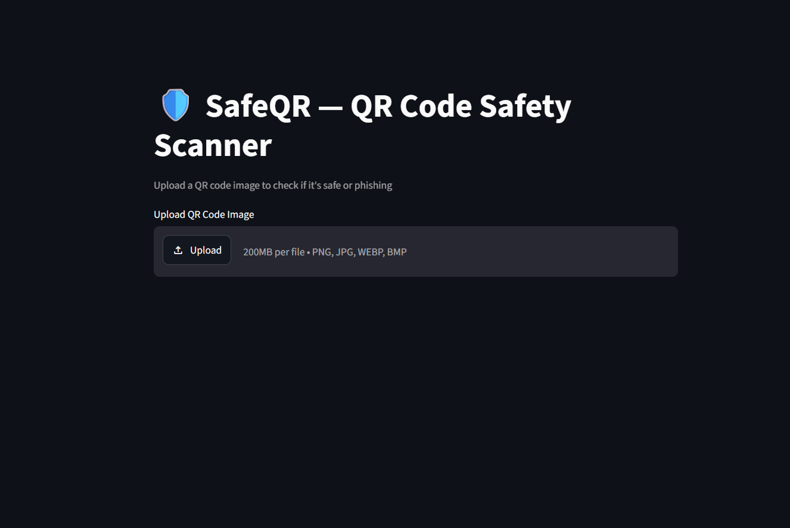
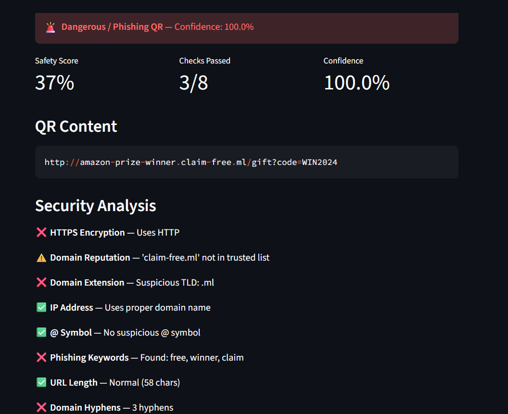
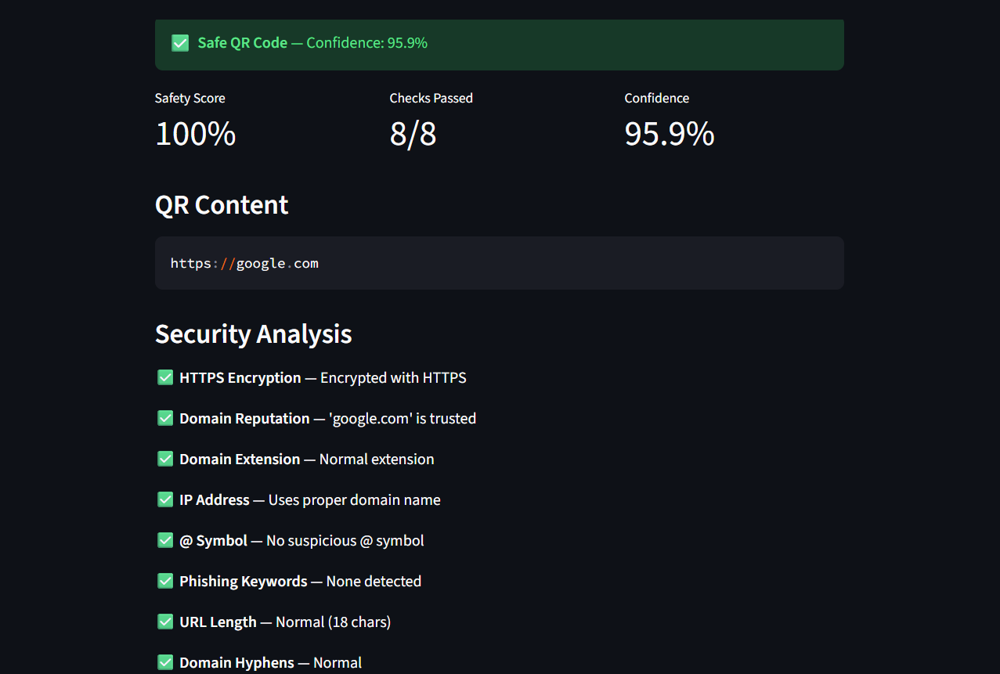
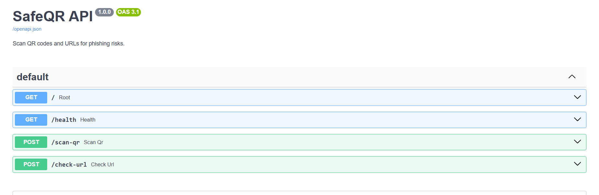

<div align="center">

# 🛡️ SafeQR — Intelligent QR Code Safety Scanner

### Scan QR codes before they scan you.

SafeQR is an end-to-end machine learning application that decodes QR codes, analyses the extracted URL or UPI payment link, and explains whether it is safe or potentially malicious.

[](https://safe-qr-ml-by-jainab.streamlit.app/)
[](https://safeqr-api-dpdz.onrender.com/docs)
[](https://hub.docker.com/r/jainab1bee/safeqr-api)
[](https://www.python.org/)

</div>

---

## 🌐 Live Services

| Service | Link |
|---|---|
| Streamlit application | [Open SafeQR](https://safe-qr-ml-by-jainab.streamlit.app/) |
| FastAPI service | [Open API](https://safeqr-api-dpdz.onrender.com) |
| Swagger documentation | [Open Swagger UI](https://safeqr-api-dpdz.onrender.com/docs) |
| Health endpoint | [Check API health](https://safeqr-api-dpdz.onrender.com/health) |
| Docker image | `jainab1bee/safeqr-api:latest` |

> The Streamlit interface and FastAPI service are deployed independently and reuse the same SafeQR detection logic.

---

## 📸 Application Preview

<table>
  <tr>
    <td align="center"><strong>QR Upload Interface</strong></td>
    <td align="center"><strong>Phishing Detection</strong></td>
  </tr>
  <tr>
    <td></td>
    <td></td>
  </tr>
  <tr>
    <td align="center"><strong>Safe QR Result</strong></td>
    <td align="center"><strong>FastAPI Swagger UI</strong></td>
  </tr>
  <tr>
    <td></td>
    <td></td>
  </tr>
</table>

---

## ✨ Key Features

- Upload QR images in PNG, JPG, JPEG, WEBP, or BMP format
- Decode QR codes using `zxing-cpp`, OpenCV, and image preprocessing fallbacks
- Detect phishing URLs using a trained Random Forest classifier
- Combine machine-learning predictions with transparent rule-based checks
- Analyse HTTPS usage, domain reputation, suspicious TLDs, IP addresses, `@` symbols, phishing keywords, URL length, and domain hyphens
- Handle UPI payment QR codes through dedicated validation rules
- Display a clear Safe or Dangerous verdict
- Show safety score, model confidence, passed checks, decoded content, and detailed explanations
- Expose the same detection workflow through a public FastAPI REST API
- Provide interactive Swagger documentation
- Package the API as a Docker image
- Deploy the frontend on Streamlit Community Cloud and the API on Render

---

## 📊 Model Performance

The Random Forest model was evaluated on a held-out test set containing **50,620 URLs**.

| Metric | Score |
|---|---:|
| Accuracy | **92.08%** |
| Precision | **93.73%** |
| Recall | **89.80%** |
| F1 Score | **91.72%** |
| ROC-AUC | **97.54%** |

### Classification Report

| Class | Precision | Recall | F1 Score | Support |
|---|---:|---:|---:|---:|
| Legitimate | 0.91 | 0.94 | 0.92 | 25,892 |
| Phishing | 0.94 | 0.90 | 0.92 | 24,728 |
| **Overall accuracy** |  |  | **0.92** | **50,620** |

### Confusion Matrix

|  | Predicted Legitimate | Predicted Phishing |
|---|---:|---:|
| Actual Legitimate | 24,406 | 1,486 |
| Actual Phishing | 2,522 | 22,206 |

The ROC-AUC score of **0.9754** shows that the model separates legitimate and phishing URLs effectively across different classification thresholds.

---

## 🧠 How SafeQR Works

```text
QR Image
   │
   ▼
QR Decoder
   │
   ▼
Extracted URL or UPI Link
   │
   ├───────────────┐
   ▼               ▼
Rule-Based      Random Forest
Checks          Prediction
   │               │
   └───────┬───────┘
           ▼
  Final Safety Verdict
           │
           ▼
Score + Confidence + Explanation
```

### 1. QR Decoding

`qr_decoder.py` attempts to decode the uploaded image using multiple strategies:

1. `zxing-cpp`
2. Resized and thresholded image variants
3. OpenCV QR detection
4. Additional fallback decoding when available

This improves detection for low-resolution, compressed, or visually noisy QR codes.

### 2. Rule-Based Security Analysis

`url_analysis.py` checks indicators commonly associated with phishing:

| Security check | Purpose |
|---|---|
| HTTPS encryption | Detects URLs using insecure HTTP |
| Domain reputation | Checks whether the domain is trusted |
| Domain extension | Flags suspicious TLDs such as `.ml`, `.tk`, or `.xyz` |
| IP address | Detects raw IP-based URLs |
| `@` symbol | Detects potentially deceptive redirection patterns |
| Phishing keywords | Finds terms such as `login`, `verify`, `claim`, `free`, or `winner` |
| URL length | Flags unusually long URLs |
| Domain hyphens | Detects excessive hyphen usage |

UPI links receive dedicated checks for scheme validity, payee information, UPI handle, and suspicious text.

### 3. Machine-Learning Prediction

`feature_extraction.py` converts every URL into numerical features used by the Random Forest model:

- URL length
- Number of dots
- HTTPS presence
- `@` symbol presence
- Hyphen count
- Slash count
- Suspicious keyword count
- Domain length

### 4. Final Decision

For standard web URLs, SafeQR combines:

- Random Forest phishing prediction
- Prediction probability
- Rule-based safety score
- Individual security check results

For UPI links, the verdict is based on dedicated UPI validation checks.

---

## 🔌 FastAPI Endpoints

| Method | Endpoint | Description |
|---|---|---|
| `GET` | `/` | API information |
| `GET` | `/health` | Service and model availability |
| `POST` | `/scan-qr` | Upload and analyse a QR code image |
| `POST` | `/check-url` | Analyse a URL or UPI string directly |
| `GET` | `/docs` | Interactive Swagger documentation |

### Check a URL

```bash
curl -X POST "https://safeqr-api-dpdz.onrender.com/check-url" \
  -H "Content-Type: application/json" \
  -d '{"url":"https://google.com"}'
```

### Scan a QR Image

```bash
curl -X POST "https://safeqr-api-dpdz.onrender.com/scan-qr" \
  -H "accept: application/json" \
  -F "file=@sample-qr.png"
```

### Example Response

```json
{
  "qr_content": "https://google.com",
  "is_dangerous": false,
  "verdict": "Safe",
  "safety_score": 100,
  "confidence": 95.9,
  "checks_passed": 8,
  "checks_total": 8,
  "checks": []
}
```

---

## 🛠️ Technology Stack

| Layer | Technologies |
|---|---|
| Programming language | Python |
| Frontend | Streamlit |
| Backend API | FastAPI, Uvicorn |
| Machine learning | scikit-learn, Random Forest |
| Image processing | OpenCV, Pillow |
| QR decoding | zxing-cpp |
| Data processing | NumPy, pandas |
| Model persistence | Pickle |
| Containerization | Docker |
| Frontend deployment | Streamlit Community Cloud |
| API deployment | Render |
| Image registry | Docker Hub |
| Version control | Git, GitHub |

---

## 📁 Project Structure

```text
SAFE_QR_ML/
├── app.py
├── api.py
├── config.py
├── feature_extraction.py
├── qr_decoder.py
├── url_analysis.py
├── train_model.py
├── model.pkl
├── evaluation_report.txt
├── requirements.txt
├── requirements-api.txt
├── Dockerfile
├── .dockerignore
├── .gitignore
├── assets/
│   ├── safeqr-upload.png
│   ├── phishing-result.png
│   ├── safe-result.png
│   └── swagger-api.png
└── README.md
```

---

## 🚀 Run Locally

### 1. Clone the Repository

```bash
git clone https://github.com/jainab-bee/SAFE_QR_ML.git
cd SAFE_QR_ML
```

### 2. Create a Virtual Environment

```bash
python -m venv venv
```

Windows:

```bash
venv\Scripts\activate
```

Linux/macOS:

```bash
source venv/bin/activate
```

### 3. Install Dependencies

```bash
pip install -r requirements.txt
```

### 4. Run the Streamlit App

```bash
python -m streamlit run app.py
```

Open `http://localhost:8501`.

### 5. Run the FastAPI Service

```bash
python -m uvicorn api:app --reload
```

Open `http://localhost:8000/docs`.

---

## 🐳 Run with Docker

### Pull from Docker Hub

```bash
docker pull jainab1bee/safeqr-api:latest
```

### Run the API Container

```bash
docker run --rm -p 8000:8000 jainab1bee/safeqr-api:latest
```

Open `http://localhost:8000/docs`.

### Build Locally

```bash
docker build -t safeqr-api .
docker run --rm -p 8000:8000 safeqr-api
```

---

## ⚙️ Configuration

Detection rules can be customised in `config.py`:

- `SAFE_DOMAINS` — trusted domains
- `BAD_TLDS` — suspicious top-level domains
- `UPI_HANDLES` — recognised UPI handles
- phishing keyword lists and safety rules

---

## 🔐 Detection Philosophy

SafeQR does not rely on a single signal. It uses a dual-layer approach:

1. **Machine learning** identifies phishing patterns from URL features.
2. **Rule-based analysis** explains the security signals behind the verdict.

This makes the result both predictive and understandable to the user.

> SafeQR provides a risk assessment and should support—not replace—careful user judgment when opening unknown links or making payments.

---

## 👩‍💻 Author

**Jainab Bee**

- GitHub: [jainab-bee](https://github.com/jainab-bee)
- Project repository: [SAFE_QR_ML](https://github.com/jainab-bee/SAFE_QR_ML)
- Live application: [SafeQR Streamlit App](https://safe-qr-ml-by-jainab.streamlit.app/)
- Live API: [SafeQR FastAPI](https://safeqr-api-dpdz.onrender.com/docs)

---

## ⭐ Support

If you found SafeQR useful, consider starring the repository.
